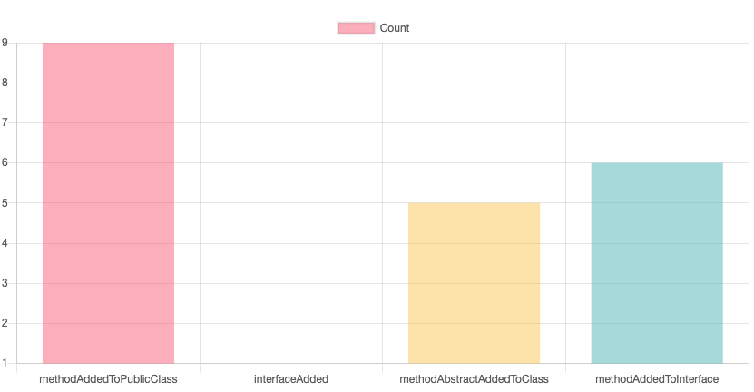
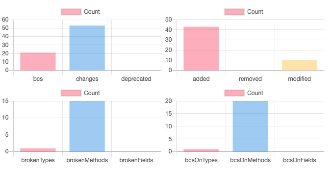
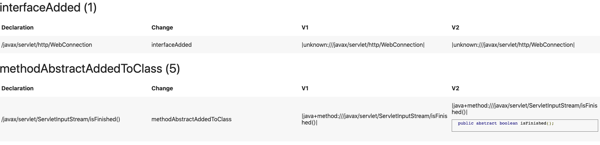

# Maracas

Maracas is a source code and bytecode analysis framework—written in Rascal and Java—that is designed to support the co-evolution of Java APIs and client code. Maracas relies on `japicmp` to compute the list of breaking changes between two API versions. Afterwards, it is able to identify declarations within a client project that are impacted by the aforementioned breaking changes (a.k.a. detections).

## Table of contents
* [Main Dependencies](#main-dependencies)
* [Getting Started](#getting-started)
* [Snapshots](#snapshots)
* [Support](#support)
* [License](#license)


## Getting Started

### Which are Maracas main dependencies?

Maracas depends on:  
  - [Rascal](https://github.com/usethesource/rascal) to parse and analyse source code and byte code (version 0.19.0 and up, get it from [this Eclipse update site](https:// https://update.rascal-mpl.org/unstable/))  
  - [japicmp](https://github.com/tdegueul/japicmp) (version 0.14.5-maracas) to compute breaking changes between two versions of a software project, and;  
  - [aethereal](https://github.com/crossminer/aethereal) (version 0.0.4) for finding and downloading artefacts from Maven Central Repository.


### How to install Maracas?

1. Install Eclipse RCP and RAP.
2. Install the unstable version of Rascal plugin from its update site `https://update.rascal-mpl.org/unstable`. 
Click [here](https://www.rascal-mpl.org/developers/) for more information.
3. Clone the `japicmp` fork from [here](https://github.com/tdegueul/japicmp) and the `aethereal` project from [here](https://github.com/crossminer/aethereal).
4. Import the aforementioned projects into your workspace.
5. Compile and install `japicmp` and `aethereal` with Maven.
6. Compile and install `maracas` with Maven.
7. Import `maracas` to your workspace.

### How to use Maracas?

Once your environment is ready and `maracas` has been imported into your workspace: 

1. Run the Rascal REPL. That is, right-click on `maracas` and select **Rascal Console**. 
2. In the REPL (`>` denotes the REPL prompt), import the `org::maracas::delta::vis::Visualizer` module:
```
> import org::maracas::delta::vis::Visualizer;
```

3. To only compute the list of breaking changes between two versions of an API and generate an HTML report, use the `mavenReport(loc report, str group, str artifact, str v1, str v2,
	str cgroup = "", str cartifact = "", str cv = "")` function *without* optional parameters: 
```
> mavenReport(|file:///Users/path/to/output/folder|, "javax.servlet", "javax.servlet-api", "3.0.1", "3.1.0")
```

4.  To compute the list of breaking changes between two versions of an API, the list of detections on a client project, and generate an HTML report, use the `mavenReport(loc report, str group, str artifact, str v1, str v2, str cgroup = "", str cartifact = "", str cv = "")` function *with* optional parameters: 
```
> mavenReport(|file:///Users/path/to/output/folder|, "javax.servlet", "javax.servlet-api", "3.0.1", "3.1.0", cgroup="org.springframework", cartifact="spring-test", cv="4.2.5.RELEASE")
```

## Snapshots 
In this section, we show some snapshots taken from the report generated for the `javax.servlet-api`-`spring-test` example introduced in the previous section.

### Breaking changes stats



### Breaking changes report



### Detections report




## Support
If you would like to learn more about `maracas` or you are a current user and you need some help, do not hesitate to send us an email at [l.m.ochoa.venegas \<at> tue.nl](mailto:l.m.ochoa.venegas@tue.nl?subject=[Maracas]%20Support) or [thomas.degueule \<at> labri.fr](mailto:thomas.degueule@labri.fr?subject=[Maracas]%20Support).


## License
 
    
This repository—and all its content—is licensed under a Creative Commons Attribution 4.0 International License. © 2018-2021 Maracas